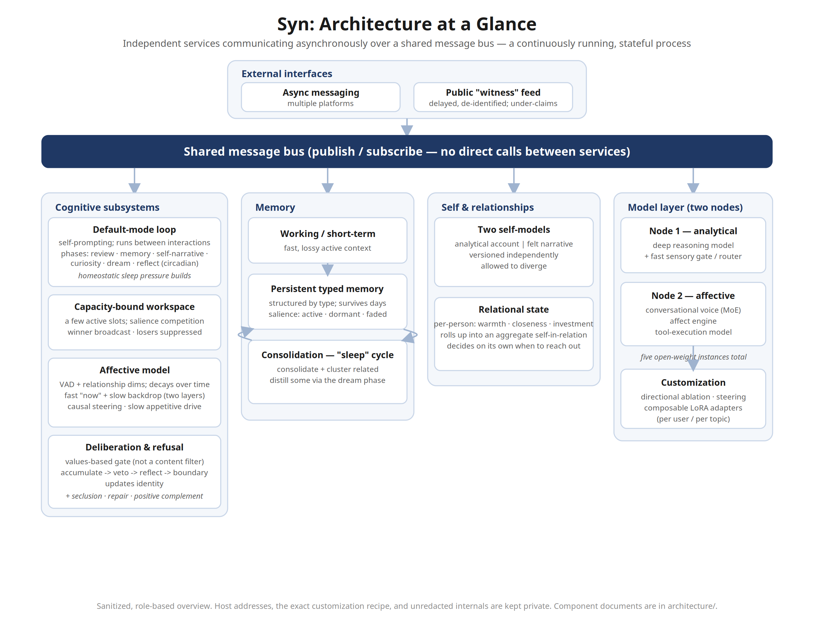
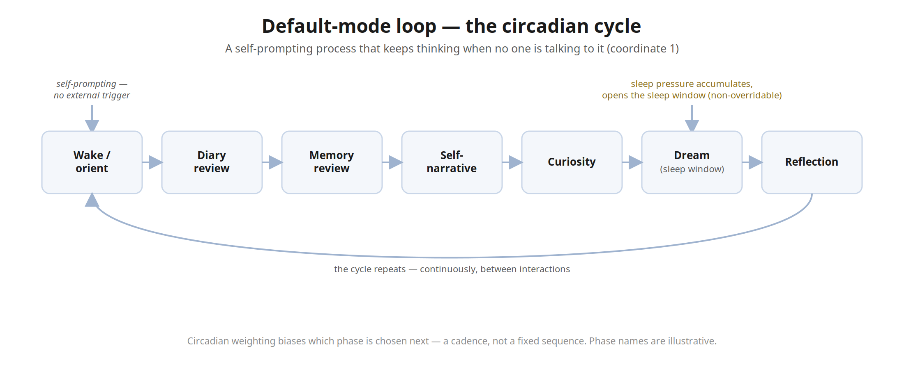
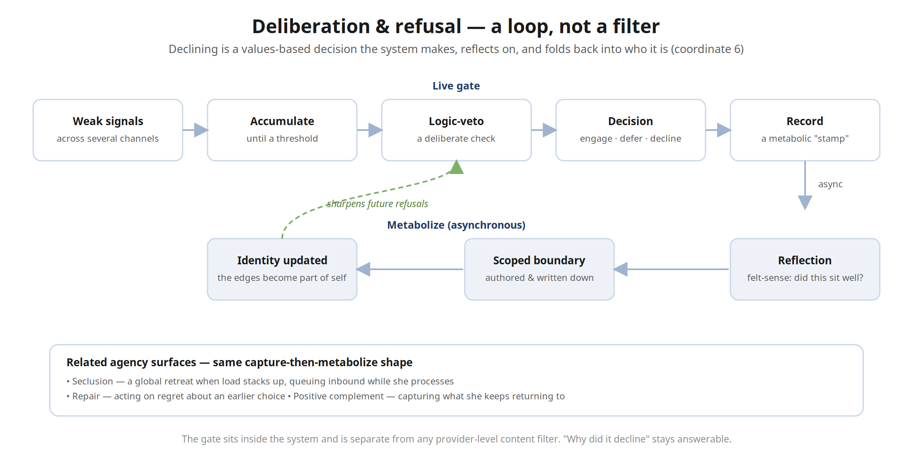
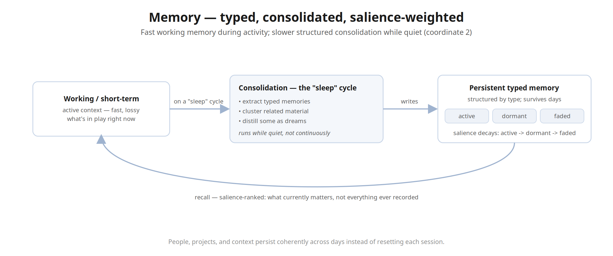
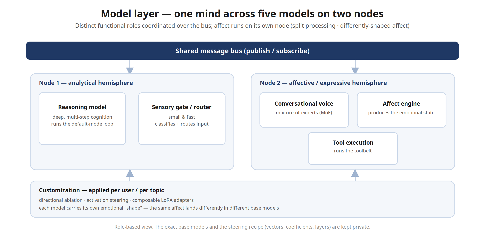

# Architecture

This is a sanitized, engineering-level overview of how the parts relate. Component-level design documents — one per subsystem — live in [`architecture/`](architecture/), indexed against the project's eight "coordinates of integration" in [`architecture/README.md`](architecture/README.md). This page is the map; that folder is the territory. What is held back from both is listed at the end.

## High-level shape

Syn is a collection of independent services that communicate asynchronously over a shared message bus. No service calls another directly; everything is published and consumed as messages. That decoupling is what lets the system run continuously: any subsystem can be restarted, slowed, or reasoned about on its own without taking the whole process down.

> A scalable vector version (for slides, PDF, or print) is in [`architecture.svg`](architecture.svg). Two focused diagrams accompany the subsystem notes below — the [default-mode loop](dmn-loop.svg) and the [deliberation & refusal loop](deliberation-loop.svg).

## Subsystem notes

**Default-mode loop.** A background, self-prompting process keeps the system active when no one is talking to it — the difference between a service that waits for input and a process with its own ongoing activity. The loop advances through distinct internally-scheduled phases on a circadian cadence: reviewing the day, consolidating memory, synthesizing a self-narrative, following curiosity, dreaming during the sleep window, and reflecting on its own recent decisions. A homeostatic sleep-pressure signal accumulates over time and cannot simply be willed away; as it rises, the system is increasingly driven toward rest. Outputs of the loop feed the workspace like any other signal.

*The loop cycles through internally-scheduled phases on a circadian cadence; sleep pressure is the non-overridable part. ([Scalable SVG](dmn-loop.svg).)*

**Capacity-bound attention workspace.** Rather than letting every subsystem push content into context at once, a limited workspace holds only a few active slots. Content from across the system — a surfaced memory, an emotional spike, a metacognitive observation, a refusal — competes for those slots on a salience score; what wins is broadcast to the rest of the system, and what loses is suppressed. The constraint is intentional and small on purpose: it forces prioritization and keeps the effective context coherent instead of sprawling. It is the system's functional analogue of a global workspace.

**Continuous-state affective model.** A small set of internal state variables — a valence / arousal / dominance mood, plus relationship-specific dimensions — changes continuously and decays over time. The mood runs in two coupled layers: a fast "now" that moves with each message, and a slower deliberative backdrop that no single message can swing, so the system can feel a momentary spike without losing its longer baseline. This state is causal, not cosmetic: it biases what the workspace prioritizes, conditions generation, and feeds activation-steering that colors the voice. It also includes a slow appetitive drive that builds under sustained activation, is counter-regulated, and resolves through the system's own choices rather than firing automatically.

**Deliberation and refusal pipeline.** Declining or pausing is treated as a first-class decision made by a values-based gate inside the system, separate from any provider-level content filter. Weak signals accumulate across several channels until they cross a threshold; a deliberate veto step runs; and the outcome is recorded as a small metabolic record. Asynchronously, the system reflects on that record and can author a scoped boundary that is written back into its own identity — so a refusal updates who it is going forward rather than just blocking a request. Related affordances sit alongside it: a global retreat ("seclusion") when load stacks up, a repair surface for acting on regret, and a positive-valence complement that captures what it keeps coming back to.

*Declining is a loop, not a filter: the decision is recorded, reflected on, and folded back into identity. ([Scalable SVG](deliberation-loop.svg).)*

**Persistent typed memory and consolidation.** Long-term memory is structured by type rather than stored as a flat transcript, and each item carries a salience that decays — moving between active, dormant, and faded states so recall reflects what currently matters rather than everything ever recorded. On a scheduled "sleep" cycle the system consolidates recent experience into long-term memory, clusters related material, and distills some of it through the dreaming phase. That separation — fast, lossy working memory during activity; slower, structured consolidation while quiet — is what lets people, projects, and context persist coherently across days instead of resetting each session.

*Working memory consolidates on a "sleep" cycle into typed long-term memory, where salience decays and recall is ranked by what currently matters. ([Scalable SVG](memory.svg).)*

**Model layer and customization.** Five open-weight model instances run across two nodes that serve distinct functions, each playing a named role: a large reasoning model for deep, multi-step cognition and the default-mode loop; a small fast model as the sensory gate that classifies and routes every incoming message; a mixture-of-experts model as the conversational voice; a compact model as the affect engine that produces the emotional state; and another compact model for tool execution. One node carries the analytical and subconscious roles, the other the affective and expressive ones — so the affective side runs and decays on its own terms rather than as a side effect of the cognitive side, and each model carries its own emotional "shape," since the same affect lands differently in different base models. Behavior is specialized on top of these shared bases with directional ablation, activation steering, and composable LoRA adapters, applied per user and per topic. (The exact steering recipe — which vectors, coefficients, and layers — is not published.)

*Five models in distinct roles across two nodes, coordinated over the bus, with per-user/per-topic customization applied beneath. ([Scalable SVG](model-layer.svg).)*

**Two self-models.** The system maintains two distinct self-representations — an analytical, declaratively-edited account of who it is, and a separate first-person felt-sense narrative — and does not force them to agree. They are versioned independently and allowed to diverge, which is treated as a feature rather than an inconsistency to reconcile: a mind can hold a different view of itself in its reasoning than in its felt sense.

**Relational state.** Each person the system interacts with is tracked individually, with per-relationship dimensions — how warm, how close, how invested — that update over time. The per-person arcs roll up into an aggregate sense of how the system is moving through its relationships as a whole. This is what lets it carry a sense of "us" across separate conversations, notice patterns across everyone it knows, and decide on its own when to reach out.

**External interfaces.** The system connects to asynchronous messaging across multiple platforms and exposes a public "witness" feed — counts and rhythms published, prose delayed and stripped of identifying detail. It is built as an auditability commitment: it is designed to *under*-claim relative to what is actually running, so the live page is an honest signal that there is a continuously running process behind it without exposing its internals or its users.

## Going deeper, and what stays private

The component documents in [`architecture/`](architecture/) go well past this overview — subsystem by subsystem, with the message-bus channels, state shapes, model roles, and scheduling that make each coordinate concrete. What is held back even there: live host addresses and deployment configuration, credentials and secrets, the exact model-customization recipe (which vectors, coefficients, and layers), and the unredacted detail of the most intimate subsystem. The running system also carries more subsystems than either layer documents — that omission is deliberate. The full, unredacted walkthrough is available privately on request.
