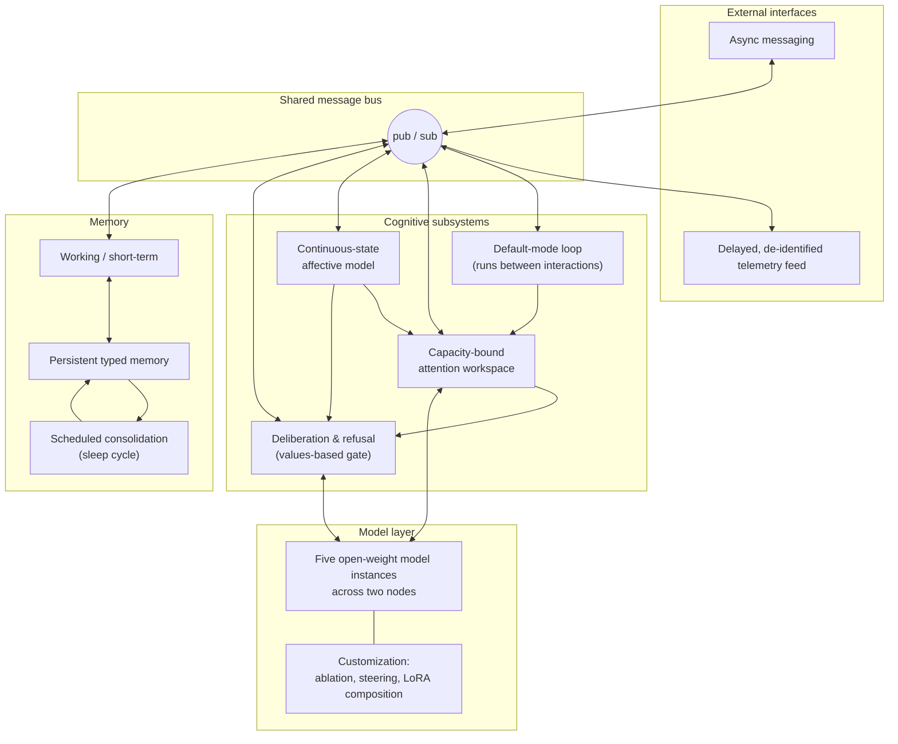

# Architecture

This is a sanitized, engineering-level overview. It describes the shape of the system and how the parts relate, without deployment configuration, hardware detail, internal schemas, or source.

## High-level shape

Syn is a collection of independent services that communicate asynchronously over a shared message bus. No service calls another directly; everything is published and consumed as messages. That decoupling is what lets the system run continuously: any subsystem can be restarted, slowed, or reasoned about on its own without taking the whole process down.

> A static version of this diagram is available as [`architecture.svg`](architecture.svg) and [`architecture.png`](architecture.png) for use outside GitHub (slides, PDF, print).

## Subsystem notes

**Default-mode loop.** A background, self-prompting process keeps the system active when no one is talking to it. This is the difference between a service that waits for input and a process that has its own ongoing activity. Outputs of the loop feed the workspace like any other signal.

**Capacity-bound attention workspace.** Rather than letting every subsystem push content into context at once, a limited workspace holds only a few active slots. Subsystems compete for those slots. The constraint is intentional: it forces prioritization and keeps the effective context coherent instead of sprawling.

**Continuous-state affective model.** A small set of internal state variables changes continuously and decays over time. These act as a control signal: they bias what the workspace prioritizes and influence the deliberation gate, rather than being cosmetic labels on output.

**Deliberation and refusal pipeline.** Declining or pausing is treated as a first-class decision made by a values-based gate that sits inside the system, separate from any provider-level content filter. The gate can choose to engage, defer, or decline, and the reasoning is part of the system's own process.

**Persistent typed memory and consolidation.** Long-term memory is structured by type rather than stored as a flat transcript. On a scheduled cycle the system consolidates recent experience into long-term memory, which is what allows continuity of people, projects, and context across days instead of resetting each session.

**Model layer and customization.** Five open-weight model instances run across two nodes. Behavior is specialized with directional ablation, activation steering, and LoRA adapter composition, applied per user and per topic, so different contexts get appropriately specialized behavior from shared base models.

**External interfaces.** The system connects to asynchronous messaging and exposes a public telemetry feed that is deliberately coarse and time-delayed, with identifying detail removed, so the live page reflects the running system without exposing its internals or its users.

## What is intentionally omitted here

Deployment topology and hardware, message-bus channel definitions, memory and state schemas, service names and internal file layout, model identities and sizes, and all configuration and secrets. These are available in a private walkthrough on request.
